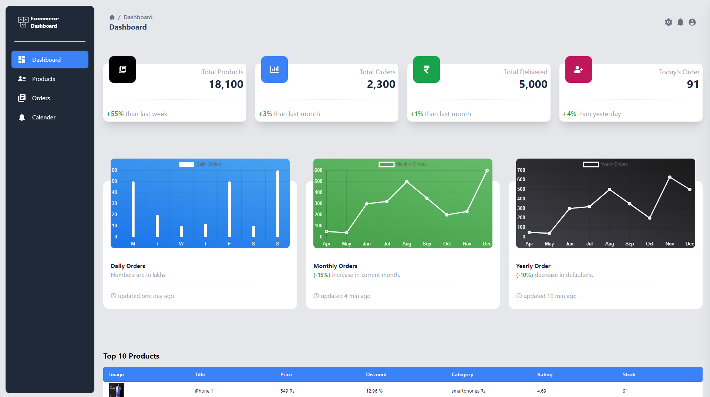
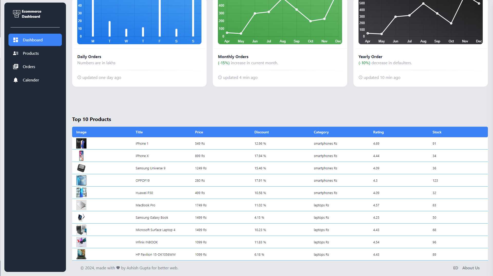
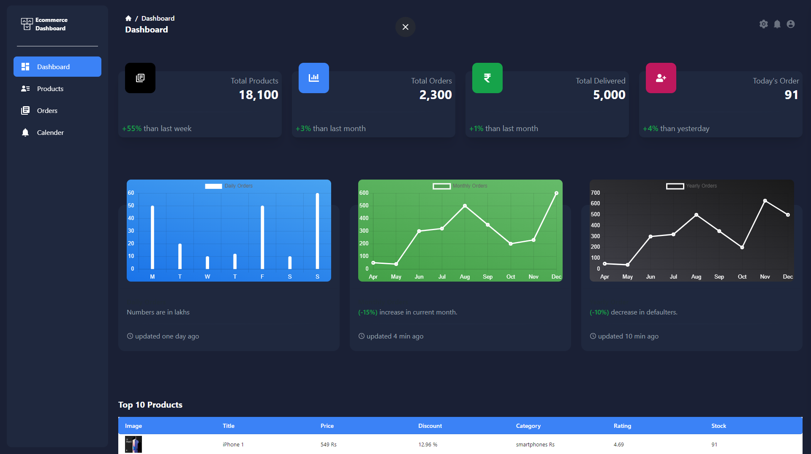
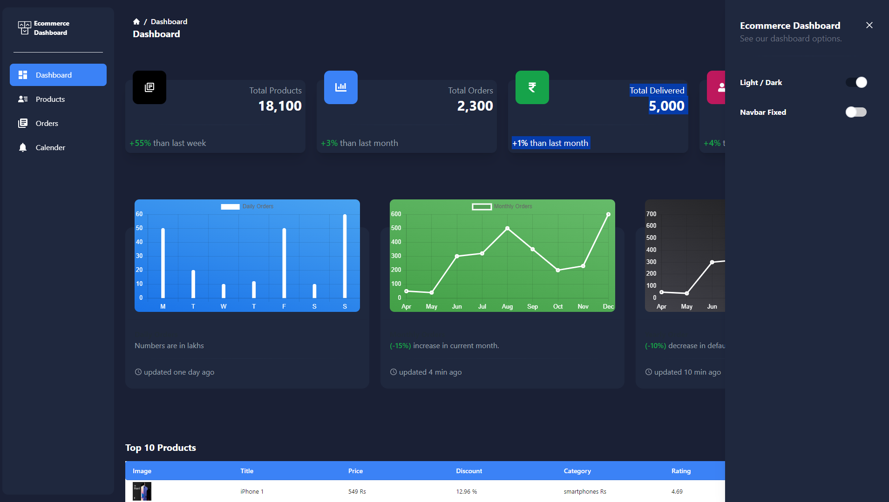
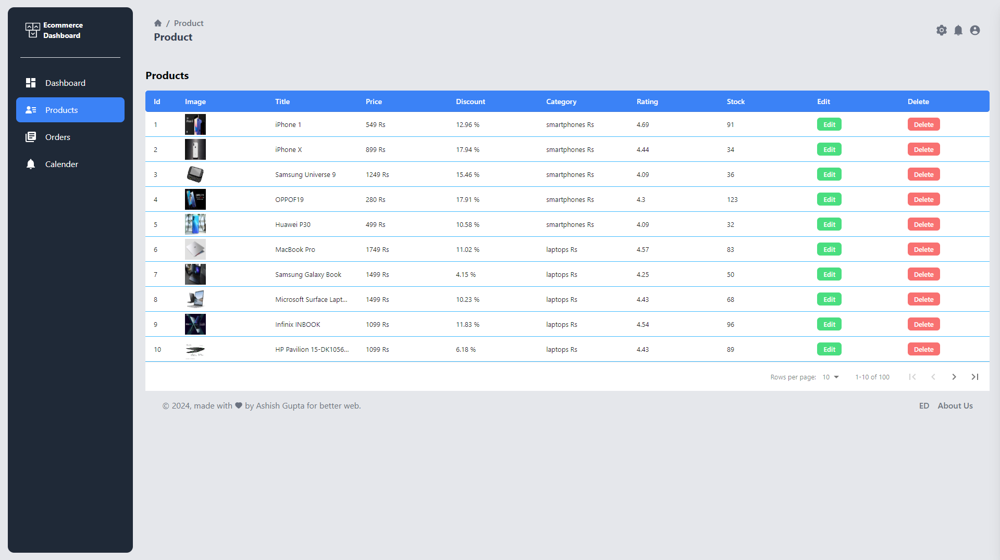
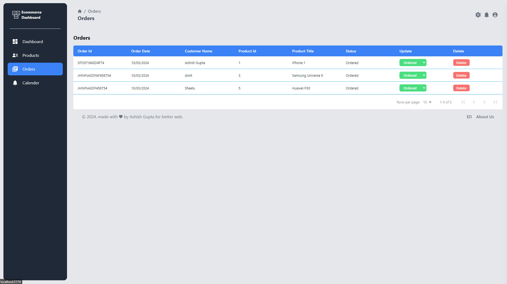
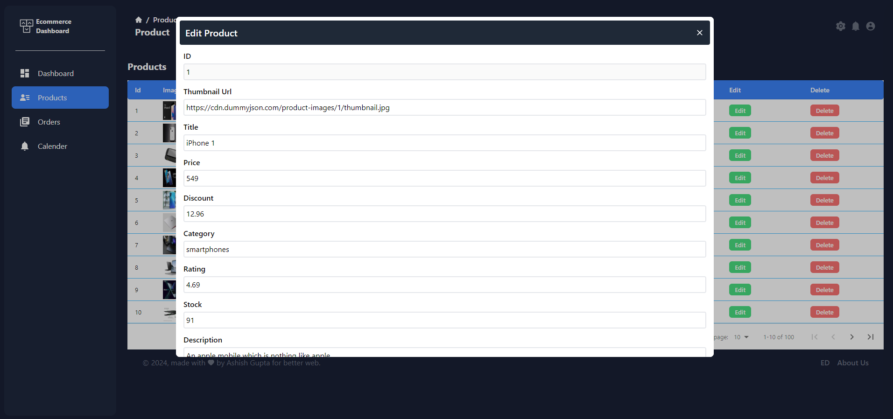

# Ecommerce DashBoard









Ecommerce DashBoard - Using React + Vite.
[Live Demo](https://ecommerce-dashboard-flax.vercel.app)

## Tech Stack

**React, React-Router-Dom, JavaScript, Tailwind, React-Icons, SCSS, CSS**

## Features

- **Architected an innovative Ecommerce Dashboard platform featuring a Porduct Management, Stats, Order Management and diverse Product**
- **Responsive Design**
- **Light Mode and Dark Mode Functionality**

## Getting Started

First you need clone this project.

```bash
git clone https://github.com/se-ashishgupta/Ecommerce-Dashboard.git
```

Now run the project..

** Client **

```bash
cd Ecommerce-Dashboard
npm install
npm start
```
